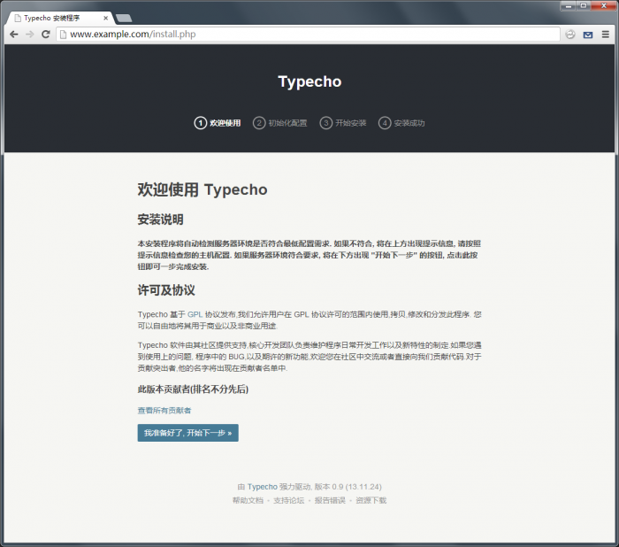

### 安装环境要求
- PHP 8.5 以上
- 数据库（MariaDB、MySQL、PostgreSQL、SQLite 任意一种），并在 PHP 中安装了对应扩展
  - MariaDB 或 MySQL 5.5.3 以上
  - SQLite 3.7.11 以上
  - PostgreSQL 9.1 以上
- 必需的 PHP 扩展：`mbstring`、`json`、`Reflection`，以及至少一种数据库扩展（`mysqli`、`sqlite3`、`pgsql`、`pdo_mysql`、`pdo_sqlite`、`pdo_pgsql`）
- `curl` 扩展为可选，仅在需要程序主动发起外部 HTTP 请求（如远程插件/升级检查等）时使用

> 安装向导会自动检测上述环境依赖，不符合时会在页面顶部给出提示。

### 下载最新版
请访问 https://github.com/Raven777777/TypechoRe/releases 获得最新的稳定版本，并下载。

### 解压缩安装包
解压缩后你会看到如下的目录结构
```
/admin/
/install/
/usr/
/var/
/index.php
/install.php
```

### 上传至服务器WEB目录
将上面列出的所有文件和目录上传到服务器上的指定目录，如`DocumentRoot`目录或者任何你希望安装`TypechoRe`的目录。

### 访问你的blog地址
上传完毕后使用浏览器直接访问安装目录即可看到`TypechoRe`的安装程序。恭喜，你的服务器可以完美支持`TypechoRe`，点击进入下一步。


### 填写配置信息
按照程序安装向导的要求填写相关服务器参数和初始化设置信息，完成后点击下一步。

- 第一步：环境检测与许可协议
- 第二步：数据库配置（选择数据库适配器、数据库地址、端口、用户名、密码、数据库名、表前缀，默认前缀为 `typecho_`）
- 第三步：创建管理员账号（用户名、密码、邮箱、站点地址）

> 如果 `config.inc.php` 无法自动创建，安装程序会给出提示，可手动在根目录创建该文件并粘贴页面中给出的配置代码。

### 完成安装
在安装成功界面中会显示管理员用户名与登录密码（若第三步未填写密码，程序会自动生成一个初始密码），请务必牢记或马上进入后台按提示更改。已经大功告成，祝您`TypechoRe`使用愉快！:)

> 万一不慎丢失初始密码可以删除安装目录下生成的`config.inc.php`文件，然后重新安装选择保留原有数据库即可。
